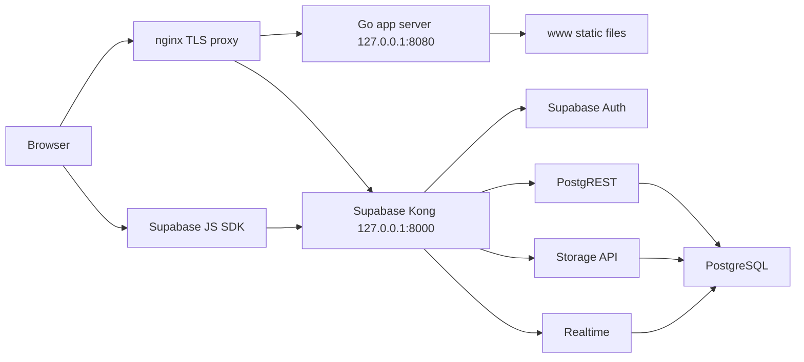

# Architecture

## System Context

## Components

### Go App Server

File: `cmd/main.go`

Responsibilities:

- Load `.env` when present.
- Validate required environment variables.
- Serve files from `WWW_DIR`.
- Intercept `/js/supabase-config.js` and render it as a Go template.
- Start HTTP or HTTPS listener depending on `WWW_USE_SSL`.

The Go server does not implement business API routes. It is a static file and config injection server.

### Frontend Shell

File: `www/index.html`

Responsibilities:

- Load styles, HEIC converter, Supabase SDK, rendered Supabase config and app scripts.
- Define the application DOM: topbar, tabs, gear cards, checklist cards and modals.
- Force HTTPS outside localhost.

The HTML shell does not define a CSP meta tag. Production CSP is an HTTP response header owned by nginx.

### Main Frontend Application

File: `www/js/app.js`

Responsibilities:

- Own in-memory state for items, checklists, category order, storage locations and UI state.
- Render gear inventory and checklist views.
- Handle auth modals, profile updates and sign-out.
- Handle create, edit, delete and reorder workflows.
- Process images and manage photo previews.
- Lazy-load checklists.
- Subscribe to realtime updates.
- Handle public share URLs.

### Supabase Service Layer

File: `www/js/supabase-service.js`

Responsibilities:

- Initialize Supabase JS client from rendered `SUPABASE_URL` and `SUPABASE_ANON_KEY`.
- Wrap Supabase Auth calls.
- Wrap CRUD for `gear_items`, `checklists`, `category_order`, `storages` and `shared_items`.
- Resolve Storage signed URLs from `gear-photos`.
- Subscribe to Realtime changes.
- Provide legacy migration helpers from browser `localStorage`.
- Map database rows to frontend visibility models.
- Read subscription entitlements, access grants and visible-search RPC results.

### Visibility UI Helper

File: `www/js/visibility-ui.js`

Responsibilities:

- Render Public / Private / Shared controls.
- Disable Private, Shared and Enable edit according to paid entitlements.
- Collect selected visibility values from forms.
- Render grantee lists with per-user Enable edit controls and active temporary links.
- Map `gear_items`, `checklists` and `storages` rows into frontend models.
- Produce visibility/source badges for search results and cards.

## Data Flow

### Application Start

1. Browser loads HTML and scripts.
2. `supabase-config.js` exposes `SUPABASE_URL` and `SUPABASE_ANON_KEY`.
3. `supabase-service.js` waits for the Supabase SDK and creates the client.
4. `app.js` listens for auth state.
5. After authentication, gear items, category order and storages load from Supabase.
6. Checklists load only when needed.

### Photo Flow

1. User selects a photo.
2. Client processes the image and calls `SupabaseService.uploadPhoto`.
3. File is uploaded to `gear-photos` under `<gear_item_id>/image.jpg`.
4. `gear_items.image_path` stores the path.
5. On render, the client creates signed URLs and caches them for 50 minutes.

### Share Link Flow

1. User shares an item or checklist.
2. Client generates an 8-character share code.
3. Client inserts a row into `shared_items` with copied JSON payload and 30-day expiry.
4. Recipient opens `?share=CODE` or `?checklist=CODE`.
5. Client loads `shared_items` by `share_code` without requiring the recipient to be signed in.
6. The link remains an anonymous, read-only snapshot and is independent from authenticated Shared grants.
7. The owner can revoke a link directly; moving a resource to Private may revoke all links when the owner selects that option.

### Visibility And Global Search Flow

1. After sign-in, the client loads `user_entitlements`.
2. Add/edit forms default to `public` and disable `private` / `shared` when entitlements do not allow them.
3. Owner CRUD calls persist visibility plus an atomic recipient list through `configure_resource_access`; recipients may be viewers or editors.
4. Personal realtime subscriptions remain owner-filtered.
5. Global visible search uses manual refresh through `search_visible_*` RPCs and exposes Public, Shared by me and Shared with me filters.
6. Viewer cards hide edit/delete controls. Editor cards allow content editing, while visibility and access controls remain owner-only.
7. RLS and update-protection triggers remain the source of truth for read/write authorization.

## Deployment Shape

The checked-in production shape is:

- App container: `nichalterego/all-my-gear:latest`, bound to `127.0.0.1:8080`.
- Supabase stack: `supabase/docker-compose.yml`, Kong bound to `127.0.0.1:8000` and `127.0.0.1:8443`.
- nginx:
  - `/` -> `127.0.0.1:8080`
  - `/auth`, `/rest`, `/storage`, `/realtime` -> `127.0.0.1:8000`
- TLS certificates from Let's Encrypt.
- Security headers, including Content Security Policy, are served by nginx. The current CSP allows app scripts/styles/fonts, Supabase HTTP/WebSocket endpoints, local Supabase development endpoints, data/blob image previews and blob workers; unused Unsplash and jsDelivr `connect-src` permissions are intentionally absent.

## Architectural Constraints

- The anon key is sent to every browser. All authorization must be enforced by Supabase RLS and Storage policies.
- There is no custom backend authorization layer.
- Direct file opening is no longer the primary runtime because config is template-rendered by Go.
- `www/js/app.js` is a high-change-risk file because many workflows share one lexical scope.
- For the MVP, Realtime covers personal owner data only. Public/shared search results are refreshed manually.
